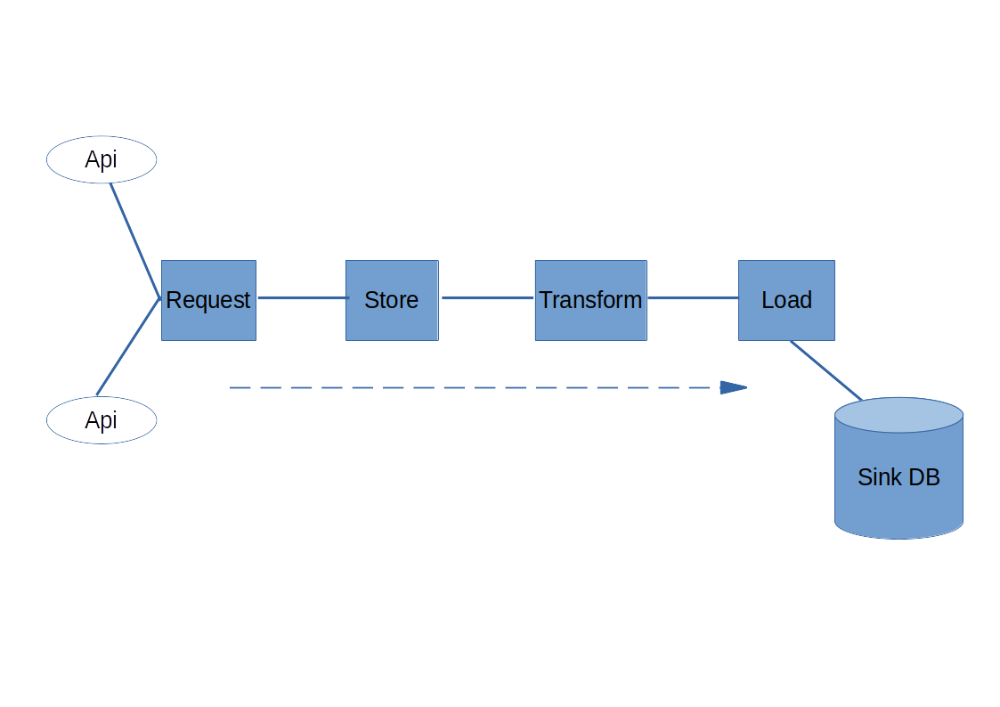

# Mobkoi task: simple python-based ETL

## Description

Sort of simple ETL example:

- Extracting data from online sources (in this case exchange-rates.com for Swiss franch (CHF) and binance.com (prices for all symbols)). Data comes down to us in json format
- Upon receiving the raw data is send to **durable storage** (local storage, ideally S3 or similar).
- Naming this files appending a _YYYYMMDDHHmmSS_ suffix. Using UTC time generated by the application (some sources don't provide timestamp in the data received). We can make multiple requests, they won't collide in the files
- Transform the data to prepare to send to the sink, the database in this case: from json to columns
- Load the data in the database. We take advantage of the timestamp if provided by the source
- Assumptions regarding to ETL runs:
  - for the Binance ETL it can be done every minute if needed
  - for the Exchange Rates every 24 hours, that is when the data is refreshed in the source. This ETL take advantage of the timestamp they include in the payload, so loading more frequent will make replicated rows

## Limitations
For the current approach:
- If more than one request to the Exchange Rates API is done within 24 hours is done, multiple files will be generated with different names due to the suffix and, if reprocessing, they will replicate similar rows.
- Configuration could be external to the application: now if we want to change the configuration, we have to redeploy everything
- Configuration also could be migrated to use classes, which provide better IDE support and decrease the chance of errors in runtime than using strings as keys for the strategy pattern chosen
- More tests could be in place, especially for the main function, by mocking both file storage and db (or their supporting functions)
- Debug and improve DevOps to completely separated from the code (-> this is a bit embarrassing)

## Error checks
- HTTP request error, both if server provides a non 200 status code or there is some _operational_ request error
- Permission to write files to the storage (currently local storage, could be extended to more files systems)
- Operational error when accessing to database (exceptions provided by `psycopg2` are caught)

## How to run

`docker-compose up -d --build`

This will generate two containers, one for the application and other for a postgresql instance.

The application container (named _mobkoitask_) will run the ETLs and will save the files in a folder named `./out`, just in the application folder. After running, check folders `./out/binance` and `./out/exchange-rates` for the files

The container with postgres remains running and we can check the contents by connecting to the port **5434**, database `mobkoi` with user/password `postgres:password` and querying tables:
- `select * from exchange_rates -- limit 12;
- `select * from binance_tickers -- limit 12;`

To stop and remove the containers do `docker-compose down` from the application folder.
